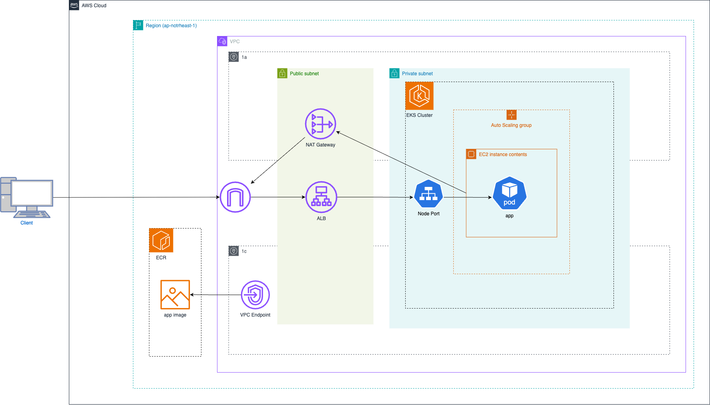

# eks-sandbox

A Kubernetes deployment sandbox with local (kind) and production (EKS) environments.

# Architecture
Architecture of the repository is as follows:



## Repository Structure

```
.
├── app/                     # Application source code
│   ├── main.go              # Go HTTP server
│   └── index.html           # Static HTML page
├── terraform/               # Infrastructure as Code
│   ├── main.tf              # EKS cluster, VPC, ALB, ECR, IAM
│   ├── provider.tf          # AWS provider configuration
│   └── backend.tf           # Terraform state backend
├── k8s/                     # Kubernetes manifests and Helm charts
│   ├── helmfile.yaml        # Multi-environment deployment config
│   ├── charts/              # Helm charts
│   │   └── http-server/     # Application Helm chart
│   ├── values/              # Environment-specific values
│   │   ├── development/     # kind cluster values
│   │   └── production/      # EKS cluster values
│   └── cluster/             # Cluster setup documentation
│       ├── kind/            # Local development cluster
│       └── eks/             # Production EKS cluster
└── Dockerfile               # Container image definition
```

## Local Development

Run the application locally with Docker:

```sh
# Build image
docker build -t app:local .

# Run container
docker run -p 8080:8080 app:local

# Access
curl http://localhost:8080
```

## Documentation

- **[Kind Cluster Operations](./k8s/cluster/kind/README.md)** - Local development with kind
- **[EKS Cluster Operations](./k8s/cluster/eks/README.md)** - Production deployment on AWS EKS

## Technologies

- **Kubernetes**: Container orchestration (kind for dev, EKS for prod)
- **Helm**: Kubernetes package manager
- **Helmfile**: Declarative multi-environment deployment
- **Terraform**: Infrastructure provisioning on AWS
- **Docker**: Container runtime
- **Go**: Application programming language
- **AWS**: EKS, ECR, ALB, VPC, Route53, ACM